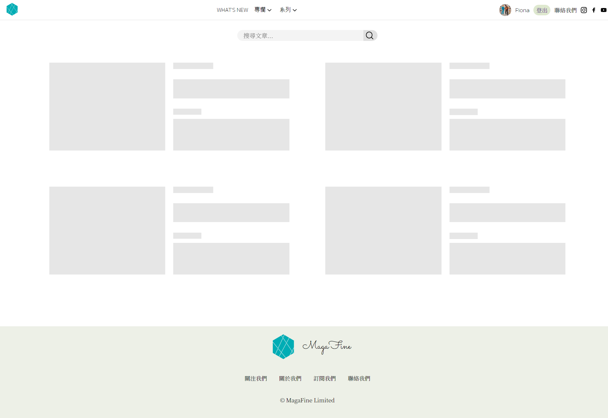
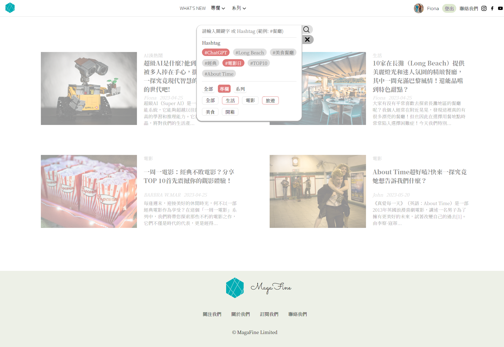
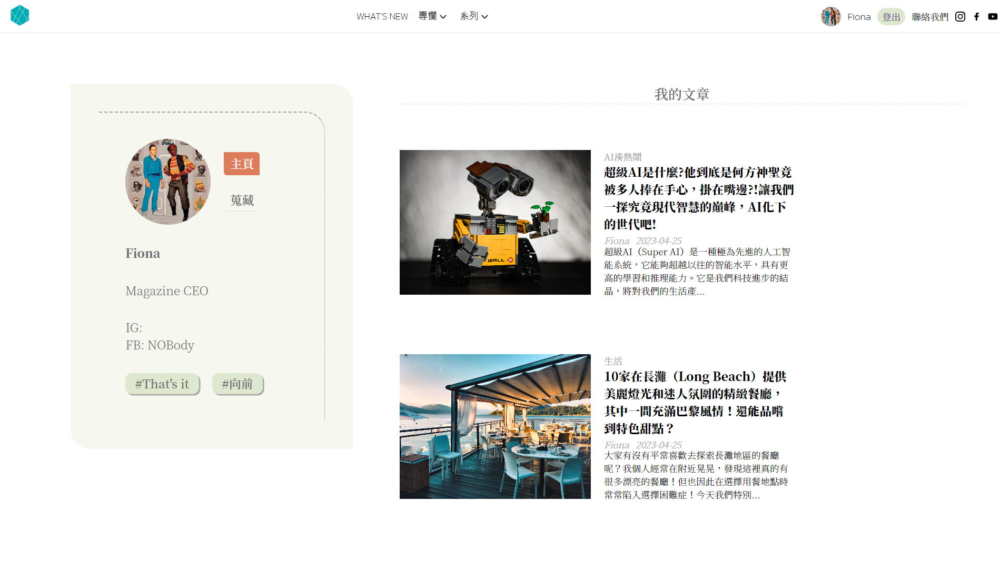
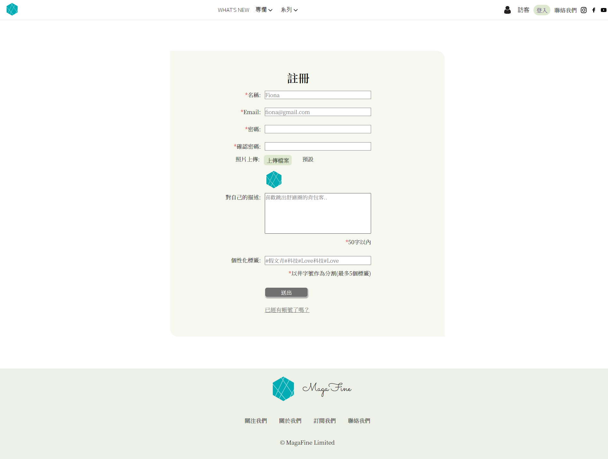

# MagaFine_Web📰
a blogger with fashion magazine style website.

【MagaFine】定位為時尚雜誌風格的網頁，具備文章搜尋、標籤查詢、使用者註冊登入、文章按讚功能。
## 技術
以React框架及SCSS製作網頁主體，採用RWD支援手機、電腦版使用者，後臺資料使用MongoDB進行管理，API採用RESTful API風格，制定符合CRUD功能的API。
- ### React
  是一種javaScript函式庫，使用JSX（JavaScript和XML）的HTML-in-JavaScript語法，使得撰寫者可以更直觀的方式理解整個程式碼的運作方式，並有效提高撰寫效率。
- ### SCSS
  CSS Preprocessor（CSS 預處理器）是用來撰寫網頁樣式的語言，編譯後再提供網頁使用。採用程式模組化支援變數設定、巢狀結構等，減少重複性撰寫、改善閱讀性、管理性與擴充彈性高等優點。
- ### MongoDB
  是一種非關聯式資料庫（NoSQL），可儲存非結構化資料 (unstructured data) 如影片、圖片、文檔等，因此相較關聯式資料庫保有更高彈性的擴充性，缺點是占用比較多空間。
- ### RESTful API
  在Web Service中使用REST概念實作出來的API簡稱為RESTful API，REST （Representational State Transfer）意思是「表現層狀態轉換」，一種設計風格，使用HTTP的協定完整定義Web Service在HTTP Request的各種流程如CRUD行為。
## 介面介紹
| | | |
|:----------------------------------------:|:-----:|:-----:|
|  |   |  |
| 首頁 | 載入畫面 | 搜尋框 |
|  |   |  |
| 下拉式選單 | 文章頁面 | 作者頁面 |
|  |   |  |
| 登入畫面 | 註冊畫面 |  |

## 參考資源
- [iThome【自己做一個價值幾十萬的動態網站，學會Mern開發、前台UI設計各式觀念與各式Lib、typescript你該學會的前端技術】系列](https://ithelp.ithome.com.tw/users/20150652/ironman/5050)
- [A day Magazine](https://www.adaymag.com/tw)
- [LA Weekly Asia](https://laweekly.asia/zh/)
